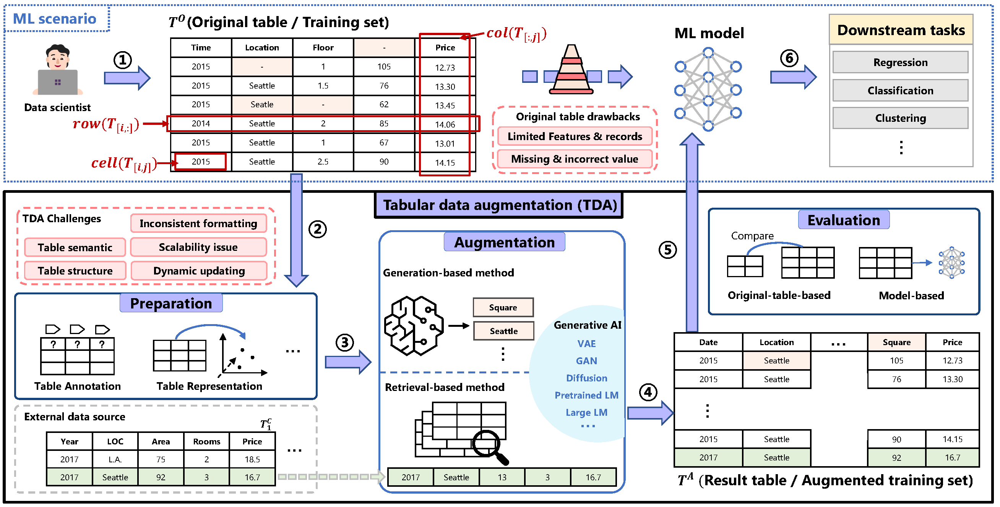

# :clubs: Tabular Data Augmentation for Machine Learning: Progress and Prospects of Embracing Generative AI.

A survey providing a comprehensive examination of tabular data augmentation (TDA) methods tailored for ML scenarios, with a special emphasis on the recent advancements in incorporating generative AI techniques. 

Checkout the latest version of the paper at [Arxiv](https://arxiv.org/abs/2407.21523).

**This content is a work in progress and will be continuously updated. Stay tuned!**

## An example of TDA for ML
① A data scientist aims to predict house prices based on factors like location and floor using an original training set ($T^O$) with limited features and records. The initial ML model yields sub-optimal results due to insufficient data and numerous missing or incorrect values. To improve performance, the scientist uses TDA to augment the original dataset with additional attributes (columns), records (rows), and corrected values (cells). ② Before augmentation, preparation steps, such as table annotation (e.g., recovering the missing column type of the 4th column in $T^O$), enhance the TDA process's effectiveness. ③ Augmentation can be achieved through retrieval-based methods (e.g., integrating the 2nd row in $T^C_1$ from external data source) or generation-based methods that synthesize new data. ④ The augmented table ($T^A$) combines the original and new data. ⑤ After augmentation, evaluation steps evaluate the effectiveness of TDA process. ⑥ Finally, the result-TDA table enable the scientist to train a more accurate price prediction model.

## TDA pipeline
The overview of TDA pipeline and the task-based taxonomy for TDA approaches. The input and output of the TDA pipeline are the original table $T^O$ and the augmented table $T^A$, respectively. The TDA pipeline comprises three main procedures: **pre-augmentation**, **augmentation**, and **post-augmentation**.

## Pre-augmentation <a href="Pre-augmentation.md"> :fast_forward: </a>
In the TDA pipeline, pre-augmentation encompasses preparation tasks to facilitate effective augmentation. Below is the overview of the pre-augmentation tasks and their target TDA tasks.

<table class="tg"><thead>
  <tr>
    <th class="tg-c3ow">No.</th>
    <th class="tg-c3ow">Reference</th>
    <th class="tg-0pky">Pub.Year</th>
    <th class="tg-c3ow">Pre-augmentation Methods</th>
  </tr></thead>
<tbody>
  <tr>
    <td class="tg-c3ow">1</td>
    <td class="tg-0pky"><a href="https://doi.org/10.14778/1920841.1921005"> Annotating and searching web tables using entities, types and relationships </a></td>
    <td class="tg-0pky">2010</td>
    <td class="tg-0pky">Table Annotation (Ontology), Table Representation(Content)</td>
  </tr>
  <tr>
    <td class="tg-c3ow">2</td>
    <td class="tg-0pky"><a href="https://doi.org/10.14778/2002938.2002939"> Recovering semantics of tables on the web</a></td>
    <td class="tg-0pky">2011</td>
    <td class="tg-0pky">Table Annotation (Ontology), Table Representation(Content), Schema Matching(Textual)</td>
  </tr>
  <tr>
    <td class="tg-c3ow">3</td>
    <td class="tg-0pky"><a href="https://doi.org/10.18637/jss.v045.i03"> MICE: Multivariate Imputation by Chained Equations in R </a></td>
    <td class="tg-0pky">2011</td>
    <td class="tg-0pky">Table Representation(Content)</td>
  </tr>
  <tr>
    <td class="tg-c3ow">4</td>
    <td class="tg-0pky"><a href="https://doi.org/10.1093/bioinformatics/btr597"> MissForest—non-parametric missing value imputation for mixed-type data </a></td>
    <td class="tg-0pky">2012</td>
    <td class="tg-0pky">Table Representation(Content)</td>
  </tr>
  <tr>
    <td class="tg-c3ow">5</td>
    <td class="tg-0pky"><a href="https://doi.org/10.1145/2213836.2213962"> Finding related tables</a></td>
    <td class="tg-0pky">2012</td>
    <td class="tg-0pky">Table Representation(Content+Metadata), Schema Matching(Textual+Meatadata), Entity Matching(KB)</td>
  </tr>
  <tr>
    <td class="tg-c3ow">6</td>
    <td class="tg-0pky"><a href="https://doi.org/10.1145/2213836.2213848"> InfoGather: entity augmentation and attribute discovery by holistic matching with web tables </a></td>
    <td class="tg-0pky">2012</td>
    <td class="tg-0pky">Table Simpification(Summariztion), Table Representation(Content+Metadata),  Table Indexing(Inverted index), Schema Matching(Textual+Meatadata)</td>
  </tr>
  <tr>
    <td class="tg-c3ow">7</td>
    <td class="tg-0pky"><a href="https://doi.org/10.1109/BDC.2015.38"> Towards a Hybrid Imputation Approach Using Web Tables </a></td>
    <td class="tg-0pky">2015</td>
    <td class="tg-0pky">Table Representation(Content+Metadata), Table Indexing(Inverted index)</td>
  </tr>
  <tr>
    <td class="tg-c3ow">8</td>
    <td class="tg-0pky"><a href="https://doi.org/10.1007/978-3-319-25007-6_25"> TabEL: Entity Linking in Web Tables </a></td>
    <td class="tg-0pky">2015</td>
    <td class="tg-0pky">Table Representation(Content), Entity Matching(DB)</td>
  </tr>
  <tr>
    <td class="tg-c3ow">9</td>
    <td class="tg-0pky"><a href="https://doi.org/10.1109/DSAA.2015.7344858"> Deep feature synthesis: Towards automating data science endeavors </a></td>
    <td class="tg-0pky">2015</td>
    <td class="tg-0pky">Table Representation(Content)</td>
  </tr>
  <tr>
    <td class="tg-c3ow">10</td>
    <td class="tg-0pky"><a href="https://doi.org/10.2200/S00655ED1V01Y201507WBE013"> Entity Resolution in the Web of Data </a></td>
    <td class="tg-0pky">2015</td>
    <td class="tg-0pky">Table Representation(Content), Entity Matching(KB)</td>
  </tr>
  <tr>
    <td class="tg-c3ow">11</td>
    <td class="tg-0pky"><a href="https://doi.org/10.1109/ICDM.2016.0123"> ExploreKit: Automatic Feature Generation and Selection </a></td>
    <td class="tg-0pky">2016</td>
    <td class="tg-0pky">Table Representation(Content)</td>
  </tr>
  <tr>
    <td class="tg-c3ow">12</td>
    <td class="tg-0pky"><a href="https://doi.org/10.14778/2994509.2994534"> LSH ensemble: internet-scale domain search </a></td>
    <td class="tg-0pky">2016</td>
    <td class="tg-0pky">Table Representation(Content), Table Indexing(LSH)</td>
  </tr>
  <tr>
    <td class="tg-c3ow">13</td>
    <td class="tg-0pky"><a href="https://doi.org/10.1145/3077136.3080796"> EntiTables: Smart Assistance for Entity-Focused Tables </a></td>
    <td class="tg-0pky">2017</td>
    <td class="tg-0pky">Table Representation(Content), Table Indexing(Inverted index), Entity Matching(KB+DB)</td>
  </tr>
  <tr>
    <td class="tg-c3ow">14</td>
    <td class="tg-0pky"><a href="https://doi.org/10.14778/3192965.3192973"> Table union search on open data </a></td>
    <td class="tg-0pky">2018</td>
    <td class="tg-0pky">Error Handling(Implicit), Table Annotation(Supervised-learning), Table Representation(Content),  Table Indexing(LSH), Schema Matching(Textual)</td>
  </tr>
  <tr>
    <td class="tg-c3ow">15</td>
    <td class="tg-0pky"><a href="https://doi.org/10.1109/ICDE.2018.00094"> Aurum: A Data Discovery System </a></td>
    <td class="tg-0pky">2018</td>
    <td class="tg-0pky">Table Representation(Content), Table Navigation(Linkage graph), Schema Matching(Numerical)</td>
  </tr>
  <tr>
    <td class="tg-c3ow">16</td>
    <td class="tg-0pky"><a href="https://doi.org/10.14778/3231751.3231757"> Data synthesis based on generative adversarial networks </a></td>
    <td class="tg-0pky">2018</td>
    <td class="tg-0pky">Table Representation(Content)</td>
  </tr>
  <tr>
    <td class="tg-c3ow">17</td>
    <td class="tg-0pky"><a href="https://proceedings.mlr.press/v80/yoon18a.html"> GAIN: Missing Data Imputation using Generative Adversarial Nets </a></td>
    <td class="tg-0pky">2018</td>
    <td class="tg-0pky">Table Representation(Content)</td>
  </tr>
  <tr>
    <td class="tg-c3ow">18</td>
    <td class="tg-0pky"><a href="https://doi.org/10.1145/3331184.3331333"> Table2Vec: Neural Word and Entity Embeddings for Table Population and Retrieval </a></td>
    <td class="tg-0pky">2019</td>
    <td class="tg-0pky">Table Representation(Content), Entity Matching(KB+DB)</td>
  </tr>
  <tr>
    <td class="tg-c3ow">19</td>
    <td class="tg-0pky"><a href="https://10.1145/3299869.3300065"> JOSIE: Overlap Set Similarity Search for Finding Joinable Tables in Data Lakes </a></td>
    <td class="tg-0pky">2019</td>
    <td class="tg-0pky">Table Representation(Content), Table Indexing(Inverted index)</td>
  </tr>
  <tr>
    <td class="tg-c3ow">20</td>
    <td class="tg-0pky"><a href="https://doi.org/10.1145/3292500.3330993"> Sherlock: A Deep Learning Approach to Semantic Data Type Detection </a></td>
    <td class="tg-0pky">2019</td>
    <td class="tg-0pky">Table Annotation(Supervised-learning), Table Representation(Content)</td>
  </tr>
  <tr>
    <td class="tg-c3ow">21</td>
    <td class="tg-0pky"><a href="https://doi.org/10.1145/3357384.3357932"> Auto-completion for Data Cells in Relational Tables </a></td>
    <td class="tg-0pky">2019</td>
    <td class="tg-0pky">Table Simpification(Summariztion), Table Representation(Content+Metadata), Entity Matching(KB+DB)</td>
  </tr>
  <tr>
    <td class="tg-c3ow">22</td>
    <td class="tg-0pky"><a href="https://proceedings.mlr.press/v97/mattei19a.html"> MIWAE: Deep Generative Modelling and Imputation of Incomplete Data Sets </a></td>
    <td class="tg-0pky">2019</td>
    <td class="tg-0pky">Table Representation(Content)</td>
  </tr>
  <tr>
    <td class="tg-c3ow">23</td>
    <td class="tg-0pky"><a href="https://doi.org/10.24963/ijcai.2019/287"> FakeTables: Using GANs to Generate Functional Dependency Preserving Tables with Bounded Real Data </a></td>
    <td class="tg-0pky">2019</td>
    <td class="tg-0pky">Table Representation(Content)</td>
  </tr>
  <tr>
    <td class="tg-c3ow">24</td>
    <td class="tg-0pky"><a href="https://openreview.net/forum?id=S1zk9iRqF7"> PATE-GAN: Generating Synthetic Data with Differential Privacy Guarantees </a></td>
    <td class="tg-0pky">2019</td>
    <td class="tg-0pky">Table Representation(Content)</td>
  </tr>
  <tr>
    <td class="tg-c3ow">25</td>
    <td class="tg-0pky"><a href="https://proceedings.neurips.cc/paper/2019/hash/254ed7d2de3b23ab10936522dd547b78-Abstract.html"> Modeling Tabular data using Conditional GAN </a></td>
    <td class="tg-0pky">2019</td>
    <td class="tg-0pky">Table Representation(Content)</td>
  </tr>
  <tr>
    <td class="tg-c3ow">26</td>
    <td class="tg-0pky"><a href="https://openreview.net/forum?id=S1lDV3RcKm"> MisGAN: Learning from Incomplete Data with Generative Adversarial Networks </a></td>
    <td class="tg-0pky">2019</td>
    <td class="tg-0pky">Table Representation(Content)</td>
  </tr>
  <tr>
    <td class="tg-c3ow">27</td>
    <td class="tg-0pky"><a href="https://doi.org/10.1016/j.patcog.2020.107501"> Handling incomplete heterogeneous data using VAEs </a></td>
    <td class="tg-0pky">2020</td>
    <td class="tg-0pky">Table Representation(Content)</td>
  </tr>
  <tr>
    <td class="tg-c3ow">28</td>
    <td class="tg-0pky"><a href="https://doi.org/10.1109/ICDE48307.2020.00067"> 
Dataset Discovery in Data Lakes
</td>
    <td class="tg-0pky">2020</td>
    <td class="tg-0pky">Error Handling(Implicit), Table Annotation(Supervised-learning), Table Representation(Content),  Table Indexing(LSH), Schema Matching(Textual+Numerical)</td>
  </tr>
  <tr>
    <td class="tg-c3ow">29</td>
    <td class="tg-0pky"><a href="https://doi.org/10.14778/3397230.3397235"> ARDA: automatic relational data augmentation for machine learning </a></td>
    <td class="tg-0pky">2020</td>
    <td class="tg-0pky">Error Handling(Explicit), Table Simplification(Sampling), Table Representation(Content)</td>
  </tr>
  <tr>
    <td class="tg-c3ow">30</td>
    <td class="tg-0pky"><a href="https://doi.org/10.1145/3318464.3389742"> Creating Embeddings of Heterogeneous Relational Datasets for Data Integration Tasks </a></td>
    <td class="tg-0pky">2020</td>
    <td class="tg-0pky">Error Handling(Explicit), Table Representation(Content+Context)</td>
  </tr>
  <tr>
    <td class="tg-c3ow">31</td>
    <td class="tg-0pky"><a href="https://doi.org/10.14778/3407790.3407793"> Sato: contextual semantic type detection in tables </a></td>
    <td class="tg-0pky">2020</td>
    <td class="tg-0pky">Error Handling(Implicit), Table Annotation(Supervised-learning),  Table Simplification(Summarization), Table Representation(Content+context)</td>
  </tr>
  <tr>
    <td class="tg-c3ow">32</td>
    <td class="tg-0pky"><a href="https://doi.org/10.1145/3318464.3380605"> Organizing Data Lakes for Navigation </a></td>
    <td class="tg-0pky">2020</td>
    <td class="tg-0pky">Table Representation (Content), Table Navigation (Linkage graph)</td>
  </tr>
  <tr>
    <td class="tg-c3ow">33</td>
    <td class="tg-0pky"><a href="https://doi.org/10.14778/3457390.3457403"> Discovering related data at scale </a> </td>
    <td class="tg-0pky">2021</td>
    <td class="tg-0pky">Table Simplification (Sampling), Table Representation (Content+Metadata)</td>
  </tr>
  <tr>
    <td class="tg-c3ow">34</td>
    <td class="tg-0pky"><a href="https://ieeexplore.ieee.org/document/9458717"> Efficient Joinable Table Discovery in Data Lakes: A High-Dimensional Similarity-Based Approach </a></td>
    <td class="tg-0pky">2021</td>
    <td class="tg-0pky">Error Handling (Implicit), Table Representation (Content), Table Indexing (Inverted index), Schema Matching (Textual)</td>
  </tr>
  <tr>
    <td class="tg-c3ow">35</td>
    <td class="tg-0pky"><a href="https://doi.org/10.14778/3476311.3476333"> Automatic data acquisition for deep learning </a></td>
    <td class="tg-0pky">2021</td>
    <td class="tg-0pky">Table Representation(Content)</td>
  </tr>
  <tr>
    <td class="tg-c3ow">36</td>
    <td class="tg-0pky"><a href="https://doi.org/10.14778/3476311.3476364"> RONIN: data lake exploration </a></td>
    <td class="tg-0pky">2021</td>
    <td class="tg-0pky">Table Representation(Content)，Table Navigation(Hierarchical structure)</td>
  </tr>
  <tr>
    <td class="tg-c3ow">37</td>
    <td class="tg-0pky"><a href="https://doi.org/10.1016/j.eswa.2021.114582"> Conditional Wasserstein GAN-based oversampling of tabular data for
 imbalanced learning </a></td>
    <td class="tg-0pky">2021</td>
    <td class="tg-0pky">Table Representation(Content)</td>
  </tr>
  <tr>
    <td class="tg-c3ow">38</td>
    <td class="tg-0pky"><a href="https://doi.org/10.5220/0010348103490356"> SIGRNN: Synthetic Minority Instances Generation in Imbalanced Datasets using a Recurrent Neural Network </a></td>
    <td class="tg-0pky">2021</td>
    <td class="tg-0pky">Table Representation(Content)</td>
  </tr>
  <tr>
    <td class="tg-c3ow">39</td>
    <td class="tg-0pky"><a href="https://doi.org/10.1109/ICMLA52953.2021.00131"> Multiple Imputation via Generative Adversarial Network for High-dimensional Blockwise Missing Value Problems </a></td>
    <td class="tg-0pky">2021</td>
    <td class="tg-0pky">Table Representation(Content)</td>
  </tr>
  <tr>
    <td class="tg-c3ow">40</td>
    <td class="tg-0pky"><a href="https://doi.org/10.1145/3514221.3517891"> Leva: Boosting Machine Learning Performance with Relational Embedding Data Augmentation </a></td>
    <td class="tg-0pky">2022</td>
    <td class="tg-0pky">Error Handling (Explicit), Table Representation (Content)</td>
  </tr>
  <tr>
    <td class="tg-c3ow">41</td>
    <td class="tg-0pky"><a href="https://doi.org/10.14778/3529337.3529353"> MATE: multi-attribute table extraction </a></td>
    <td class="tg-0pky">2022</td>
    <td class="tg-0pky">Table Representation (Content), Table Indexing (Inverted index)</td>
  </tr>
  <tr>
    <td class="tg-c3ow">42</td>
    <td class="tg-0pky"><a href="https://doi.org/10.14778/3574245.3574274"> Integrating Data Lake Tables </a></td>
    <td class="tg-0pky">2022</td>
    <td class="tg-0pky">Table Annotation (PLMs), Table Representation (Content), Table Navigation (Clustering)</td>
  </tr>
  <tr>
    <td class="tg-c3ow">43</td>
    <td class="tg-0pky"><a href="https://doi.org/10.1109/ICDE53745.2022.00317"> Feature Augmentation with Reinforcement Learning </a></td>
    <td class="tg-0pky">2022</td>
    <td class="tg-0pky">Table Simplification (Sampling), Table Representation (Content)</td>
  </tr>
  <tr>
    <td class="tg-c3ow">44</td>
    <td class="tg-0pky"><a href="https://doi.org/10.14778/3523210.3523223"> Selective data acquisition in the wild for model charging </a> </td>
    <td class="tg-0pky">2022</td>
    <td class="tg-0pky">Table Representation (Content), Table Navigation (Clustering)</td>
  </tr>
  <tr>
    <td class="tg-c3ow">45</td>
    <td class="tg-0pky"><a href="https://doi.org/10.1109/ICDE53745.2022.00264"> A Sketch-based Index for Correlated Dataset Search </a></td>
    <td class="tg-0pky">2022</td>
    <td class="tg-0pky">Table Representation(Content), Table Navigation(Linkage graph), Schema Matching(Numerical)</td>
  </tr>
  <tr>
    <td class="tg-c3ow">46</td>
    <td class="tg-0pky"><a href="https://doi.org/10.1145/3485447.3511972"> StruBERT: Structure-aware BERT for Table Search and Matching </a></td>
    <td class="tg-0pky">2022</td>
    <td class="tg-0pky">Table Representation(Content)</td>
  </tr>
  <tr>
    <td class="tg-c3ow">47</td>
    <td class="tg-0pky"><a href="https://doi.org/10.1145/3542700.3542709"> TURL: Table Understanding through Representation Learning </a></td>
    <td class="tg-0pky">2022</td>
    <td class="tg-0pky">Error Handling (Implicit), Table Simplification (Summarization), Table Representation (Content+Context+Metadata)</td>
  </tr>
  <tr>
    <td class="tg-c3ow">48</td>
    <td class="tg-0pky"><a href="https://doi.org/10.1109/TKDE.2021.3091101"> Data Lake Organization </a></td>
    <td class="tg-0pky">2022</td>
    <td class="tg-0pky">Table Representation (Content), Table Navigation (Linkage graph)</td>
  </tr>
  <tr>
    <td class="tg-c3ow">49</td>
    <td class="tg-0pky"><a href="https://doi.org/10.1145/3514221.3517906"> Annotating Columns with Pre-trained Language Models </a></td>
    <td class="tg-0pky">2022</td>
    <td class="tg-0pky">Table Annotation (PLMs), Table Representation (Content+Context)</td>
  </tr>
  <tr>
    <td class="tg-c3ow">50</td>
    <td class="tg-0pky"><a href="https://papers.nips.cc/paper_files/paper/2022/hash/1377f76686d56439a2bd7a91859972f5-Abstract-Conference.html"> TransTab: Learning Transferable Tabular Transformers Across Tables </a></td>
    <td class="tg-0pky">2022</td>
    <td class="tg-0pky">Table Representation (Content), Table Navigation (Linkage graph)</td>
  </tr>
  <tr>
    <td class="tg-c3ow">51</td>
    <td class="tg-0pky"><a href="https://doi.org/10.1145/3534678.3539454"> SOS: Score-based Oversampling for Tabular Data </a></td>
    <td class="tg-0pky">2022</td>
    <td class="tg-0pky">Table Representation(Content)</td>
  </tr>
  <tr>
    <td class="tg-c3ow">52</td>
    <td class="tg-0pky"><a href="https://doi.org/10.1145/3626766"> Watchog: A Light-weight Contrastive Learning based Framework for Column Annotation </a></td>
    <td class="tg-0pky">2023</td>
    <td class="tg-0pky">Error Handling (Implicit), Table Annotation (PLMs), Table Simplification (Summarization),  Table Representation (Content+Context+Metadata)</td>
  </tr>
  <tr>
    <td class="tg-c3ow">53</td>
    <td class="tg-0pky"><a href="https://doi.org/10.14778/3603581.3603587"> DeepJoin: Joinable Table Discovery with Pre-Trained Language Models </a></td>
    <td class="tg-0pky">2023</td>
    <td class="tg-0pky">Error Handling (Implicit), Table Simplification (Sampling), Table Representation (Content),  Table Indexing (HNSW), Schema Matching (Textual)</td>
  </tr>
  <tr>
    <td class="tg-c3ow">54</td>
    <td class="tg-0pky"><a href="https://doi.org/10.1145/3588689"> SANTOS: Relationship-based Semantic Table Union Search </a></td>
    <td class="tg-0pky">2023</td>
    <td class="tg-0pky">Error Handling (Implicit), Table Annotation (Supervised-learning), Table Simplification (smallsetminus),  Table Representation (Content+Context), Table Indexing (Inverted index), Schema Matching (Textual)</td>
  </tr>
  <tr>
    <td class="tg-c3ow">55</td>
    <td class="tg-0pky"><a href="https://doi.org/10.14778/3587136.3587146"> Semantics-Aware Dataset Discovery from Data Lakes with Contextualized Column-Based Representation Learning </a></td>
    <td class="tg-0pky">2023</td>
    <td class="tg-0pky">Error Handling (Implicit), Table Annotation (smallsetminus), Table Simplification (Sampling),  Table Representation (Content+Context), Table Indexing (LSH+HNSW), Schema Matching (Textual)</td>
  </tr>
  <tr>
    <td class="tg-c3ow">56</td>
    <td class="tg-0pky"><a href="https://doi.org/10.18653/v1/2023.findings-acl.233"> Automatic Table Union Search with Tabular Representation Learning </a></td>
    <td class="tg-0pky">2023</td>
    <td class="tg-0pky">Error Handling (Implicit), Table Simplification (Sampling), Table Representation (Content+Context)</td>
  </tr>
  <tr>
    <td class="tg-c3ow">57</td>
    <td class="tg-0pky"><a href="https://doi.org/10.18653/v1/2023.findings-acl.348"> Retrieval-Based Transformer for Table Augmentation </a></td>
    <td class="tg-0pky">2023</td>
    <td class="tg-0pky">Error Handling (Implicit), Table Representation (Content+Context+Metadata)</td>
  </tr>
  <tr>
    <td class="tg-c3ow">58</td>
    <td class="tg-0pky"><a href="https://papers.nips.cc/paper_files/paper/2023/hash/66178beae8f12fcd48699de95acc1152-Abstract-Conference.html"> HyTrel: Hypergraph-enhanced Tabular Data Representation Learning </a></td>
    <td class="tg-0pky">2023</td>
    <td class="tg-0pky">Error Handling (Implicit), Table Representation (Content+Context)</td>
  </tr>
  <tr>
    <td class="tg-c3ow">59</td>
    <td class="tg-0pky"><a href="https://openreview.net/pdf?id=fPVRcJqspu"> GOGGLE: GENERATIVE MODELLING FOR TABULAR
 DATA BY LEARNING RELATIONAL STRUCTURE </a></td>
    <td class="tg-0pky">2023</td>
    <td class="tg-0pky">Table Representation (Content+Context)</td>
  </tr>
  <tr>
    <td class="tg-c3ow">60</td>
    <td class="tg-0pky"><a href="https://doi.org/10.1007/s10115-023-01834-5"> Interpretable tabular data generation </a></td>
    <td class="tg-0pky">2023</td>
    <td class="tg-0pky">Table Representation(Content)</td>
  </tr>
  <tr>
    <td class="tg-c3ow">61</td>
    <td class="tg-0pky"><a href="https://openreview.net/pdf?id=1mNssCWt_v"> STASY: SCORE-BASED TABULAR DATA SYNTHESIS </a></td>
    <td class="tg-0pky">2023</td>
    <td class="tg-0pky">Table Representation(Content)</td>
  </tr>
  <tr>
    <td class="tg-c3ow">62</td>
    <td class="tg-0pky"><a href="https://proceedings.mlr.press/v202/lee23i.html"> CoDi: Co-evolving Contrastive Diffusion Models for Mixed-type Tabular Synthesis </a></td>
    <td class="tg-0pky">2023</td>
    <td class="tg-0pky">Table Representation(Content)</td>
  </tr>
  <tr>
    <td class="tg-c3ow">63</td>
    <td class="tg-0pky"><a href="https://doi.org/10.48550/ARXIV.2210.17128"> Diffusion models for missing value imputation in tabular data </a></td>
    <td class="tg-0pky">2023</td>
    <td class="tg-0pky">Table Representation(Content)</td>
  </tr>
  <tr>
    <td class="tg-c3ow">64</td>
    <td class="tg-0pky"><a href="https://doi.org/10.1109/ICDM58522.2023.00078"> Beyond Discrete Selection: Continuous Embedding Space Optimization for Generative Feature Selection </a></td>
    <td class="tg-0pky">2023</td>
    <td class="tg-0pky">Table Representation(Content)</td>
  </tr>
  <tr>
    <td class="tg-c3ow">65</td>
    <td class="tg-0pky"><a href="https://papers.nips.cc/paper_files/paper/2023/hash/8797d13e5998acfab387d4bf0a5b9b00-Abstract-Conference.html"> Reinforcement-Enhanced Autoregressive Feature Transformation: Gradient-steered Search in Continuous Space for Postfix Expressions </a></td>
    <td class="tg-0pky">2023</td>
    <td class="tg-0pky">Table Representation(Content)</td>
  </tr>
  <tr>
    <td class="tg-c3ow">66</td>
    <td class="tg-0pky"><a href="https://doi.org/10.48786/EDBT.2025.07"> OmniMatch: Overcoming the Cold-Start Problem in Cross-Domain Recommendations using Auxiliary Reviews </a></td>
    <td class="tg-0pky">2024</td>
    <td class="tg-0pky">Error Handling(Implicit), Table Representation (Content), Table Navigation (Linkage graph)</td>
  </tr>
  <tr>
    <td class="tg-c3ow">67</td>
    <td class="tg-0pky"><a href="https://doi.org/10.48550/ARXIV.2406.09534"> FeatNavigator: Automatic Feature Augmentation on Tabular Data </a></td>
    <td class="tg-0pky">2024</td>
    <td class="tg-0pky">Error Handling(Implicit), Table Representation (Content)</td>
  </tr>
  <tr>
    <td class="tg-c3ow">68</td>
    <td class="tg-0pky"><a href="https://doi.org/10.1145/3639283"> Controllable Tabular Data Synthesis Using Diffusion Models </a></td>
    <td class="tg-0pky">2024</td>
    <td class="tg-0pky">Table Representation(Content)</td>
  </tr>
  <tr>
    <td class="tg-c3ow">69</td>
    <td class="tg-0pky"><a href="https://www.cidrdb.org/cidr2024/papers/p72-lin.pdf"> SMARTFEAT:Efficient Feature Construction through Feature-Level Foundation Model Interactions </a></td>
    <td class="tg-0pky">2024</td>
    <td class="tg-0pky">Error Handling(Implicit), Table Representation (Content+Context)</td>
  </tr>
  <tr>
    <td class="tg-c3ow">70</td>
    <td class="tg-0pky"><a href="https://doi.org/10.48550/ARXIV.2406.01457"> Differentially Private Tabular Data Synthesis using Large Language Models </a></td>
    <td class="tg-0pky">2024</td>
    <td class="tg-0pky">Error Handling(Implicit), Table Representation (Content)</td>
  </tr>
</tbody></table>

## Augmentation <a href="Augmentation.md"> :fast_forward: </a>

## :mag_right: Retrieval-based

###  Entity Augmentation

[SIGMOD'12] **InfoGather: entity augmentation and attribute discovery by holistic matching with web tables**
[[paper](https://doi.org/10.1145/2213836.2213848)]

[VLDB'18] **Table union search on open data.**
[[paper](https://doi.org/10.14778/3192965.3192973)]

[ICDE'20] **Dataset Discovery in Data Lakes**
[[paper](https://doi.org/10.1109/ICDE48307.2020.00067)]

[SIGMOD'12] **Finding related tables**
[[paper](https://doi.org/10.1145/2213836.2213962)]

[SIGIR'17] **EntiTables: Smart Assistance for Entity-Focused Tables**
[[paper](https://doi.org/10.1145/3077136.3080796)]

[SIGIR'19] **Table2Vec: Neural Word and Entity Embeddings for Table Population and Retrieval**
[[paper](https://doi.org/10.1145/3331184.3331333)]

[SIGMOD'23] **SANTOS: Relationship-based Semantic Table Union Searchtaset Discovery from Data Lakes with Contextualized Column-based Representation Learning**
[[paper](https://dl.acm.org/doi/10.1145/3588689)]
[[official code](https://github.com/northeastern-datalab/santos)]

[SIGMOD'20] **Creating Embeddings of Heterogeneous Relational Datasets for Data Integration Tasks**
[[paper](https://doi.org/10.1145/3318464.3389742)]

[NIPS'23] **HyTrel: Hypergraph-enhanced Tabular Data Representation Learning**
[[paper](https://papers.nips.cc/paper_files/paper/2023/hash/66178beae8f12fcd48699de95acc1152-Abstract-Conference.html)]

[VLDB'23] **Semantics-aware Dataset Discovery from Data Lakes with Contextualized Column-based Representation Learning.**
[[paper](https://doi.org/10.14778/3587136.3587146)]

[ACL'23] **Automatic Table Union Search with Tabular Representation Learning**
[[paper](https://doi.org/10.18653/v1/2023.findings-acl.233)]

###  Schema Augmentation

[VLDB'16] **LSH ensemble: internet-scale domain search**
[[paper](https://doi.org/10.14778/2994509.2994534)]

[SIGMOD'19] **JOSIE: Overlap Set Similarity Search for Finding Joinable Tables in Data Lakes.**
[[paper](https://doi.org/10.1145/3299869.3300065)]

[VLDB'20] **ARDA: automatic relational data augmentation for machine learning**
[[paper](https://doi.org/10.14778/3397230.3397235)]

[ICDE'22] **Feature Augmentation with Reinforcement Learning**
[[paper](https://doi.org/10.1109/ICDE53745.2022.00317)]

[CoRR'24] **FeatNavigator: Automatic Feature Augmentation on Tabular Data**
[[paper](https://doi.org/10.48550/ARXIV.2406.09534)]

[ICDE'21] **Efficient Joinable Table Discovery in Data Lakes: A High-Dimensional Similarity-Based Approach.**
[[paper](https://doi.org/10.1109/ICDE51399.2021.00046)]

[VLDB'23] **DeepJoin: Joinable Table Discovery with Pre-Trained Language Models**
[[paper](https://doi.org/10.14778/3603581.3603587)]

[EDBT'24] **OmniMatch:OvercomingtheCold-StartProblem in Cross-Domain Recommendations using Auxiliary Reviews.**
[[paper](https://doi.org/10.48786/EDBT.2025.07)]

[SIGMOD'20] **Creating Embeddings of Heterogeneous Relational Datasets for Data Integration Tasks**
[[paper](https://doi.org/10.1145/3318464.3389742)]

[SIGMOD'22] **Leva: Boosting Machine Learning Performance with Relational Embedding DataAugmentation**
[[paper](https://doi.org/10.1145/3514221.3517891)]

###  Cell Completion

[SIGMOD'12] **InfoGather: entity augmentation and attribute discovery by holistic matching with web tables**
[[paper](https://doi.org/10.1145/2213836.2213848)]

[SIGIR'17] **EntiTables: Smart Assistance for Entity-Focused Tables**
[[paper](https://doi.org/10.18653/v1/2023.findings-acl.348)]

[ACL'23] **Retrieval-Based Transformer for Table Augmentation**
[[paper](https://doi.org/10.18653/v1/2023.findings-acl.348)]

[SIGMOD'22] **TURL:TableUnderstanding through Representation Learning**
[[paper](https://doi.org/10.1145/3542700.3542709)]

[BDC'15] **Towards a Hybrid Imputation Approach Using Web Tables**
[[paper](https://doi.org/10.1109/BDC.2015.38)]

[CIKM'19] **Auto-completion for Data Cells in Relational Tables**
[[paper](https://doi.org/10.1145/3357384.3357932)]

###  Table Integration

[SIGMOD'12] **InfoGather: entity augmentation and attribute discovery by holistic matching with web tables**
[[paper](https://doi.org/10.1145/2213836.2213848)]

[SIGIR'17] **EntiTables: Smart Assistance for Entity-Focused Tables**
[[paper](https://doi.org/10.18653/v1/2023.findings-acl.348)]

[ACL'23] **Retrieval-Based Transformer for Table Augmentation**
[[paper](https://doi.org/10.18653/v1/2023.findings-acl.348)]

[VLDB'22] **Integrating Data Lake Tables**
[[paper](https://doi.org/10.14778/3574245.3574274)]

[SIGMOD'22] **Leva: Boosting Machine Learning Performance with Relational Embedding DataAugmentation**
[[paper](https://doi.org/10.1145/3514221.3517891)]

## :wrench: Generation-based

###  Record Generation

[SIGMOD'07] **Privacy, accuracy, and consistency too: a holistic solution to contingency table release**
[[paper](https://doi.org/10.1145/1265530.1265569)]

[SIGMOD'14] **PrivBayes: private data release via bayesian networks**
[[paper](https://doi.org/10.1145/2588555.2588573)]

[ICLR'19] **PATE-GAN: Generating Synthetic Data with Differential Privacy Guarantees**
[[paper](https://openreview.net/forum?id=S1zk9iRqF7)]

[VLDB'18] **Data synthesis based on generative adversarial networks**
[[paper](https://doi.org/10.14778/3231751.3231757)]

[IJCAI'19] **FakeTables: Using GANs to Generate Functional Dependency Preserving Tables with Bounded Real Data**
[[paper](https://doi.org/10.24963/ijcai.2019/287)]

[KAIS'23] **Interpretable tabular data generation**
[[paper](https://doi.org/10.1007/s10115-023-01834-5)]

[ICLR'23] **STaSy: Score-based Tabular data Synthesis**
[[paper](https://openreview.net/pdf?id=1mNssCWt_v)]

[ICLR'23] **GOGGLE: Generative modelling for tabular data by learning relational structure**
[[paper](https://openreview.net/pdf?id=fPVRcJqspu)]

[ICML'23] **CoDi: Co-evolving Contrastive Diffusion Models for Mixed type Tabular Synthesis**
[[paper](https://proceedings.mlr.press/v202/lee23i.html)]

[SIGMOD'24] **Controllable Tabular Data Synthesis Using Diffusion Models**
[[paper](https://doi.org/10.1145/3639283)]

[CoRR'24] **Differentially Private Tabular Data Synthesis using Large Language Models**
[[paper](https://doi.org/10.48550/ARXIV.2406.01457)]

[NIPS'19] **Modeling Tabular data using Conditional GAN**
[[paper](https://proceedings.neurips.cc/paper/2019/hash/254ed7d2de3b23ab10936522dd547b78-Abstract.html)]

[ESWA'21] **Conditional Wasserstein GAN-based oversampling of tabular data for imbalanced learning**
[[paper](https://doi.org/10.1016/j.eswa.2021.114582)]

[ICPRAM'21] **SIGRNN: Synthetic Minority Instances Generation in Imbalanced Datasets using a Recurrent Neural Network**
[[paper](https://doi.org/10.5220/0010348103490356)]

[SIGKDD'22] **SOS: Score-based Oversampling for Tabular Data**
[[paper](https://doi.org/10.1145/3534678.3539454)]

###  Feature Construction

[DSAA'15] **Deep feature synthesis: Towards automating data science endeavors**
[[paper](https://doi.org/10.1109/DSAA.2015.7344858)]

[ICDM'16] **ExploreKit: Automatic Feature Generation and Selection**
[[paper](https://doi.org/10.1109/ICDM.2016.0123)]

[CIDR'24] **SMARTFEAT: Efficient Feature Construction through Feature-Level Foundation Model Interactions**
[[paper](https://www.cidrdb.org/cidr2024/papers/p72-lin.pdf)]

[ICDM'23] **Beyond Discrete Selection: Continuous Embedding Space Optimization for Generative Feature Selection**
[[paper](https://doi.org/10.1109/ICDM58522.2023.00078)]

[NIPS'23] **Reinforcement-Enhanced Autoregressive Feature Transformation: Gradient-steered Search in Continuous Space for Postfix Expressions**
[[paper](https://papers.nips.cc/paper_files/paper/2023/hash/8797d13e5998acfab387d4bf0a5b9b00-Abstract-Conference.html)]

###  Cell Imputation

[J. Stat. Soft.'11] **MICE : Multivariate Imputation by Chained Equations in R**
[[paper](https://doi.org/10.18637/jss.v045.i03)]

[Bioinformatics'12] **MissForest—non-parametric missing value imputation for mixed-type data**
[[paper](https://doi.org/10.1093/bioinformatics/btr597)]

[ICML'19] **MIWAE: Deep Generative Modelling and Imputation of Incomplete Data Sets**
[[paper](https://doi.org/10.1016/j.patcog.2020.107501)]

[PR'20] **Handling incomplete heterogeneous data using VAEs**
[[paper](https://doi.org/10.1145/2213836.2213848)]

[ICML'18] **GAIN: Missing Data Imputation using Generative Adversarial Nets**
[[paper](https://proceedings.mlr.press/v80/yoon18a.html)]

[ICMLA'21] **Multiple Imputation via Generative Adversarial Network for High dimensional Blockwise Missing Value Problems**
[[paper](https://doi.org/10.1109/ICMLA52953.2021.00131)]

[CoRR'22] **Diffusion models for missing value imputation in tabular data**
[[paper](https://doi.org/10.48550/ARXIV.2210.17128)]

###  Table Synthesis

[NIPS'22] **TransTab: Learning Transferable Tabular Transformers Across Tables**
[[paper](https://papers.nips.cc/paper_files/paper/2022/hash/1377f76686d56439a2bd7a91859972f5-Abstract-Conference.html)]

## Post-augmentation <a href="Post-augmentation.md"> :fast_forward: </a>

## :date: TDA Datasets

<table class="tg"><thead>
  <tr>
    <th class="tg-0pky">No.</th>
    <th class="tg-0pky">Dataset</th>
    <th class="tg-0pky">Tables</th>
    <th class="tg-0pky">Columns</th>
    <th class="tg-0pky">Avg # Columns</th>
    <th class="tg-0pky">Rows</th>
    <th class="tg-0pky">Avg # Rows</th>
    <th class="tg-0pky">URL</th>
  </tr></thead>
<tbody>
  <tr>
    <td class="tg-0pky">1</td>
    <td class="tg-0pky">Web_Manual</td>
    <td class="tg-0pky">371</td>
    <td class="tg-0pky">-</td>
    <td class="tg-0pky">-</td>
    <td class="tg-0pky">18921</td>
    <td class="tg-0pky">51</td>
    <td class="tg-0pky">http://websail-fe.cs.northwestern.edu/TabEL/#Web_Manual</td>
  </tr>
  <tr>
    <td class="tg-0pky">2</td>
    <td class="tg-0pky">Wiki_Link</td>
    <td class="tg-0pky">6085</td>
    <td class="tg-0pky">-</td>
    <td class="tg-0pky">-</td>
    <td class="tg-0pky">121700</td>
    <td class="tg-0pky">20</td>
    <td class="tg-0pky">http://websail-fe.cs.northwestern.edu/TabEL/#Wiki_Link</td>
  </tr>
  <tr>
    <td class="tg-0pky">3</td>
    <td class="tg-0pky">WDC web table corpus</td>
    <td class="tg-0pky">50M</td>
    <td class="tg-0pky">250M</td>
    <td class="tg-0pky">5</td>
    <td class="tg-0pky">700M</td>
    <td class="tg-0pky">14</td>
    <td class="tg-0pky">https://webdatacommons.org/webtables/#results-2015</td>
  </tr>
  <tr>
    <td class="tg-0pky">4</td>
    <td class="tg-0pky">WikiTables corpus</td>
    <td class="tg-0pky">1.6M</td>
    <td class="tg-0pky">30.4M</td>
    <td class="tg-0pky">19</td>
    <td class="tg-0pky">-</td>
    <td class="tg-0pky">-</td>
    <td class="tg-0pky">http://websail-fe.cs.northwestern.edu/TabEL/#WikiTables</td>
  </tr>
  <tr>
    <td class="tg-0pky">5</td>
    <td class="tg-0pky">TUS Small</td>
    <td class="tg-0pky">1,530</td>
    <td class="tg-0pky">14,810</td>
    <td class="tg-0pky">10</td>
    <td class="tg-0pky">6.8 M</td>
    <td class="tg-0pky">4,466</td>
    <td class="tg-0pky">https://github.com/RJMillerLab/table-union-search-benchmark</td>
  </tr>
  <tr>
    <td class="tg-0pky">6</td>
    <td class="tg-0pky">TUS Large</td>
    <td class="tg-0pky">5,043</td>
    <td class="tg-0pky">54,923</td>
    <td class="tg-0pky">11</td>
    <td class="tg-0pky">9.7M</td>
    <td class="tg-0pky">1,915</td>
    <td class="tg-0pky">https://github.com/RJMillerLab/table-union-search-benchmark</td>
  </tr>
  <tr>
    <td class="tg-0pky">7</td>
    <td class="tg-0pky">SANTOS Small</td>
    <td class="tg-0pky">550</td>
    <td class="tg-0pky">6,322</td>
    <td class="tg-0pky">11</td>
    <td class="tg-0pky">3.8 M</td>
    <td class="tg-0pky">6,921</td>
    <td class="tg-0pky">https://github.com/northeastern-datalab/santos</td>
  </tr>
  <tr>
    <td class="tg-0pky">8</td>
    <td class="tg-0pky">SANTOS Large</td>
    <td class="tg-0pky">11,090</td>
    <td class="tg-0pky">123,477</td>
    <td class="tg-0pky">11</td>
    <td class="tg-0pky">70 M</td>
    <td class="tg-0pky">7,675</td>
    <td class="tg-0pky">https://github.com/northeastern-datalab/santos</td>
  </tr>
  <tr>
    <td class="tg-0lax" colspan="8"></td>
  </tr>
  <tr>
    <td class="tg-0pky">9</td>
    <td class="tg-0pky">BTS</td>
    <td class="tg-0pky">1</td>
    <td class="tg-0pky">30</td>
    <td class="tg-0pky">-</td>
    <td class="tg-0pky">1M</td>
    <td class="tg-0pky">-</td>
    <td class="tg-0pky">https://www.transtats.bts.gov/DataIndex.asp</td>
  </tr>
  <tr>
    <td class="tg-0pky">10</td>
    <td class="tg-0pky">UCI datasets  (e.g.,Adult, Covertype)</td>
    <td class="tg-0pky">-</td>
    <td class="tg-0pky">-</td>
    <td class="tg-0pky">-</td>
    <td class="tg-0pky">-</td>
    <td class="tg-0pky">-</td>
    <td class="tg-0pky">https://archive.ics.uci.edu</td>
  </tr>
  <tr>
    <td class="tg-0pky">11</td>
    <td class="tg-0pky">Kaggle  (e.g., Diabetes, Bank)</td>
    <td class="tg-0pky">-</td>
    <td class="tg-0pky">-</td>
    <td class="tg-0pky">-</td>
    <td class="tg-0pky">-</td>
    <td class="tg-0pky">-</td>
    <td class="tg-0pky">https://www.kaggle.com</td>
  </tr>
  <tr>
    <td class="tg-0pky">12</td>
    <td class="tg-0pky">OpenML repository  (e.g., Heart, Horce)</td>
    <td class="tg-0pky">-</td>
    <td class="tg-0pky">-</td>
    <td class="tg-0pky">-</td>
    <td class="tg-0pky">-</td>
    <td class="tg-0pky">-</td>
    <td class="tg-0pky">https://www.openml.org</td>
  </tr>
</tbody></table>

## :triangular_ruler:  Evaluation Polices

###  Original-table-based evaluation

[SIGIR'17] **EntiTables: Smart Assistance for Entity-Focused Tables**
[[paper](https://doi.org/10.1145/3077136.3080796)]

[SIGIR'19] **Table2Vec: Neural Word and Entity Embeddings for Table Population and Retrieval**
[[paper](https://doi.org/10.1145/3331184.3331333)]

[VLDB'18] **Data synthesis based on generative adversarial networks**
[[paper](https://doi.org/10.14778/3231751.3231757)]

[IJCAI'19] **FakeTables: Using GANs to Generate Functional Dependency Preserving Tables with Bounded Real Data**
[[paper](https://doi.org/10.24963/ijcai.2019/287)]

###  Model-based evaluation

[VLDB'22] **Selective data acquisition in the wild for model charging**
[[paper](https://doi.org/10.14778/3523210.3523223)]

[IJCAI'19] **FakeTables: Using GANs to Generate Functional Dependency Preserving Tables with Bounded Real Data**
[[paper](https://doi.org/10.24963/ijcai.2019/287)]

[VLDB'23] **Semantics-aware Dataset Discovery from Data Lakes with Contextualized Column-based Representation Learning.**
[[paper](https://doi.org/10.14778/3587136.3587146)]

[ICDE'23] **Metam: Goal-Oriented Data Discovery**
[[paper](https://doi.org/10.1109/ICDE55515.2023.00213)]

[CoRR'24] **FeatNavigator: Automatic Feature Augmentation on Tabular Data**
[[paper](https://doi.org/10.48550/ARXIV.2406.09534)]

[ICDE'22] **Feature Augmentation with Reinforcement Learning**
[[paper](https://doi.org/10.1109/ICDE53745.2022.00317)]

[VLDB'18] **Data synthesis based on generative adversarial networks**
[[paper](https://doi.org/10.14778/3231751.3231757)]

[SIGMOD'22] **Leva: Boosting Machine Learning Performance with Relational Embedding DataAugmentation**
[[paper](https://doi.org/10.1145/3514221.3517891)]

## :chart_with_upwards_trend: Optimization Strategies

### Iteration-based optimization

[VLDB'20] **ARDA: automatic relational data augmentation for machine learning**
[[paper](https://doi.org/10.14778/3397230.3397235)]

[SIGMOD'22] **Leva: Boosting Machine Learning Performance with Relational Embedding DataAugmentation**
[[paper](https://doi.org/10.1145/3514221.3517891)]

[CoRR'24] **FeatNavigator: Automatic Feature Augmentation on Tabular Data**
[[paper](https://doi.org/10.48550/ARXIV.2406.09534)]

### Reinforcement-learning-based optimization

[VLDB'21] **Automatic data acquisition for deep learning**
[[paper](https://doi.org/10.14778/3476311.3476333)]

[ICDE'22] **Feature Augmentation with Reinforcement Learning**
[[paper](https://doi.org/10.1109/ICDE53745.2022.00317)]

[VLDB'22] **Selective data acquisition in the wild for model charging**
[[paper](https://doi.org/10.14778/3523210.3523223)]

